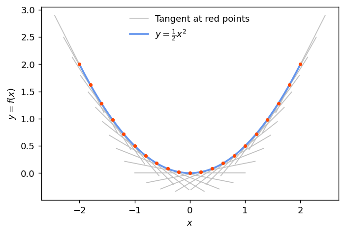

# Linear Regression

Our first task, a warm-up if you will, is to build a linear regression model. 
This is an example of a ==supervised learning== task where we have a set inputs (features) and a corresponding set of outputs (targets).
To achieve this, we need the three ingredients discussed in the Background section, namely:

1. a model,
2. a cost (a.k.a. loss) function,
3. a recipe to optimize the model, i.e., to update its free parameters.


### The model

For now, let's restrict to linear functions of one variable. Linear means that the dependent variable, let's call it $x$, does not appear with a power larger than 1 (so not $x^2$ for example, and also not with negative powers or non-integer powers). The most general linear function of one variable is thus,
$$
y = f(x) = w\,x + b\,.
$$
This model has 2 ==parameters==, the slope $w$ and the offset $b$. Our task is to ==learn== these parameters in order to best describe a dataset.

!!! example "Implement the model"
	
	```python
	import numpy as np
	
	def fx(x: np.ndarray, a: float, b: float) -> np.ndarray:
	
	    y = ...

	    return y	
	```

### Loss function

The purpose of the loss function is to tell us "how well" we are able model the data for particular values of the parameters. The better the model describes the data, the smaller the loss ought to be.

A common loss function in regression is the Mean-Squared Error (MSE) which is given by
$$
\mathcal{L} = \frac{1}{N}\sum_{i=1}^N \left(y_i - t_i\right)^2\,,
$$
where $N$ is the number of $(x,t)$, i.e. (feature, target), pairs in the dataset and $y$ is the output of the model. (Technically, this is the expectation of the loss, $\mathbb{E}\left[\mathcal{L}\right]$.)
This loss function arises naturally if the underlying variation in the data is Gaussian which is many cases is a good assumption. However, one drawback of MSE loss is that it is sensitive to "outliers" in the data. We will examine this in more detail later and discuss possible mitigation strategies.

!!! example "Implement the loss function"

	```python
	def loss(x: np.ndarray, t: np.ndarray, a: float, b: float) -> float:
	    """Compute the MSE loss and return it
	    """

	    mse_loss = ...

	    return mse_loss
	```


### Optimization

Now that we have a model and loss function, we need the third ingredient: a recipe to update the model parameters in order to minimize the loss. Well, the loss function we chose, MSE, is "differentiable" and a method for optimizing differentiable functions has been around since the mid 19th century. This method is known as _gradient descent_ optimization.

Things are getting a bit technical here and there is lot to unpack so let's look at it bit by bit:

<div class="annotate" markdown>
1. The ==gradient== of a function of more than one variable is a "vector" (better yet, it _transforms_ as a vector) whose components are the partial derivatives of the function with respect to those variables (1). The derivative of a function at a point is the slope of the tangent to that curve; in the figure just below, you can see a blue curve with red dots, the gray lines are the tangents to the curve at those dots.

2. Now the second part: ==descent==. So the derivative tells us the how steep or not the curve is at a point. Well, calculus tells us that the function has an _extremum_, i.e. a maximum or a minimum, where its (first) derivative is zero! That is, when the tangent curve is flat. ==We want to find the minimum because that is where the loss function is smallest==.

3. So the gradient tells us if the function is steep or flat. If it's steep, we want to **descend** down to where it's less steep until we get to the (or _a_) minimum where it's flat -- that's gradient descent!
</div>

1.  Okay, so where did the "more-than-one-variable" thing happen here? Recall that we want to optimize the loss function with respect to the parameters and our model has two of those!

<figure markdown="span">
  { width="600" }
  <figcaption>The gray segments are the tangents to the blue curve at each red point. The slope of the tangent lines are the values of the first derivative of the curve at each point.</figcaption>
</figure>

Back to our loss function and its gradient. The `loss_gradient` function will have to return two values not just one; i.e., the derivatives with respect to the slope, $w$, and the offset, $b$. Those are given by 

\begin{equation*}
\begin{split}
\frac{\partial\mathcal{L}}{\partial w} &= \frac{2}{N}\sum_{i=1}^N\left(w\,x_i^2 + b\,x_i - t_i\,x_i\right)\,,\\
\frac{\partial\mathcal{L}}{\partial b} &= \frac{2}{N}\sum_{i=1}^N\left(w\,x_i + b - t_i\right)\,.
\end{split}
\end{equation*}

!!! example "Implement the gradient of the loss function"

	```python
	def loss_gradient(x: np.ndarray, t: np.ndarray, a: float, b: float) -> tuple[float, float]:
	    """Compute the gradien of the loss function
	    """

	    dloss_dw = ...
	    dloss_db = ...

	    return (dloss_dw, dloss_db)
	```

#### The gradient descent algorithm

Now that we have the `loss_gradient` functions implemented, it's time to put it to use as follows:

<div class="annotate" markdown>
1. Start with _guesses_ for $w$ and $b$
2. Compute the gradient using those values
3. Update them to the new value $w'$ and $b'$ as:
    - $w' = w - \eta\,\frac{\partial\mathcal{L}}{\partial w}$
    - $b' = b - \eta\,\frac{\partial\mathcal{L}}{\partial b}$
4. Repeat this procedure until the loss ceases to get smaller (1).

The parameter $\eta$ should be small (i.e., $\eta <1$) and is called the ==learning rate==. Choosing the learning rate is one the most important (and tricky) ==hyperparameters== of the model to set.
</div>
1. When and how exactly to stop this procedure is quite a deep topic by itself.

!!! info "Stochastic gradient descent"

	Techinically, computing the gradient as described above means computing the gradient over the entire dataset. This, however, is slow and inefficient. A very convenient way to circumvent these problems is to compute the gradient on a subset of the data (a.k.a. a **batch**). These batches should be chosen randomly and should be anywhere from $\sim 32$ points to something larger :smile: depending on the size of the dataset for example.


!!! example "Implement stochastic gradient descent"

	The following pseudocode is adapted from the SGD algorithm (8.1) from the [Deep Learning](https://www.deeplearningbook.org/) book by Goodfellow, Bengio, and Courville [see chapter 8, page 291]
	```ruby
	Require: learning rate, eta
	Require: initial parameters, w and b
	k = 1
	while (do another epoch == True) do
	    loop over minibatches
	        compute loss function
	        compute gradient of loss function: dloss_dw, dloss_db
	        update parameters: w = w - eta * dloss_dw
	                           b = b - eta * dloss_db
	    k = k + 1
	end while
	```
