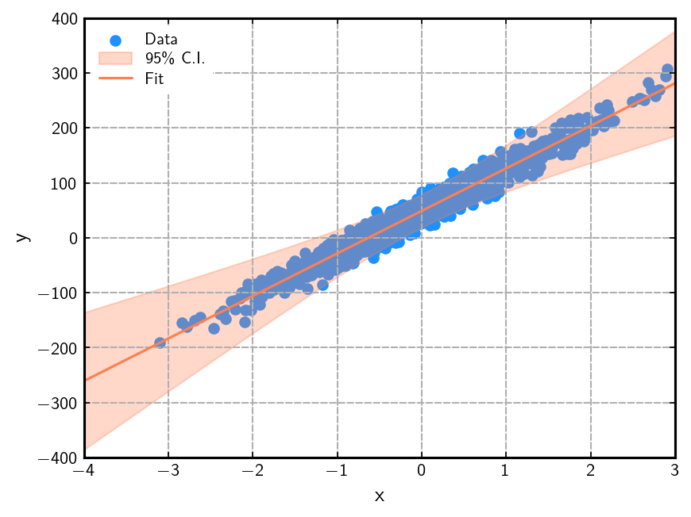

# Closed-form solution

First, let us generalize the loss function just a little bit more by adding a ==regularization== term to it -- see this [Wikipedia article](https://en.wikipedia.org/wiki/Regularization_&lpar;mathematics&rpar;#Regularization_in_machine_learning) for a very brief introduction to the topic.

??? question "Why would we want to regularize the model?"
    In this simple case with a one-dimensional function (i.e., with one dependent variable), regularization does not actually help; this is easy to show explicitly :construction:.
    However, when the model becomes more complex and has many parameters, the regularization term penalizes complexity and, thus, overfitting.

With this additional term, the loss function becomes,
$$
\mathcal{L} = \frac{1}{N}\sum_{i=1}^N \left(y_i - t_i\right)^2 + \lambda\,\Omega(w,b)\,,
$$
where $\lambda$ is a coefficient that controls the relative size (i.e., effect) of the regularization term, $\Omega$ which is a function of the parameters, $w$ and $b$.
Two well established (and well motivated) choices for the regularization term are:

| Type       | Form of $\mathbf{\Omega}$ | Used in |
| :--------: | :-----------: | -------------------------------------- |
| $L_2-$norm |  $w^2 + b^2$   | [Ridge regression](https://en.wikipedia.org/wiki/Ridge_regression)                   |
| $L_1-$norm | $\lvert w\rvert + \lvert b\rvert$   | [LASSO](https://en.wikipedia.org/wiki/Lasso_&lpar;statistics&rpar;) |

In this slightly more complicated but still simple case, and with a bit of algebra, we can find a closed form solution for the parameters $w$ and $b$. The loss function here is strictly convex and thus has a unique minimum. The solution can be found by solving the linear set of equations $\nabla\mathcal{L}=\vec{0}$ with ==$L_2$== regularization and is given by,

\begin{equation*}
\begin{split}
w &= \frac{\mathrm{cov}(X, T) + \lambda\langle XT\rangle}{
\mathrm{var}\,X + \lambda\langle X^2\rangle + \lambda(1+\lambda)
}\,,\\
b &= \frac{1}{1+\lambda}\left[\langle{T}\rangle - w\,\langle{X}\rangle\right]\,.
\end{split}
\end{equation*}

The captial letters mean the full vector of features, $x$, and targets, $t$, in the dataset. The operators $\mathrm{cov}$ and $\mathrm{var}$ are the covariance and variance respectively. They can be computed with the [NumPy](https://numpy.org/) functions `#!numpy numpy.cov` and `#!numpy numpy.var`. Finally, quantities enclosed in angled brackets as in $\langle{X}\rangle$ means the average (`#!numpy numpy.mean`) over the features in the datasets and similarly for the targets and the product of the features with the targets.

## Estimating the error on the fitted parameters

!!! danger "This section is techincal"
    
One can get a lower bound on the variance of the fitted parameters (or, to be more technically correct, the variance of the _estimators_). This is known as the [Cramér-Rao](https://en.wikipedia.org/wiki/Cram%C3%A9r%E2%80%93Rao_bound) bound which says this variance is bounded from below by the inverse of the Fisher information, i.e.,

\begin{equation*}
\mathrm{var}(\hat{\boldsymbol\theta})\geq I(\boldsymbol\theta)^{-1}\,,
\end{equation*}

where $I(\boldsymbol\theta)$ is the [Fisher information matrix](https://en.wikipedia.org/wiki/Fisher_information#Matrix_form) which is proportional to the Hessian of the loss function

\begin{equation*}
\left[I(\boldsymbol\theta)\right]_{ij} = -N\,\mathbb{E}\left[
    \frac{\partial^2}{\partial\theta_i\partial\theta_j} \log\,f(\boldsymbol{X};\boldsymbol\theta)\Biggr|\boldsymbol\theta
\right]\,,
\end{equation*}

where $f$ is the likelihood function (1) which is related to our loss function via
{ .annotate }

1. I'm slightly confused here :confounded:, this (taken from Wikipedia) is not a likelihood but looks rather like a probability...

\begin{equation*}
-\log f = \frac{\mathcal{L}}{2S^2}\,.
\end{equation*}

Note that the (unbiased) _sample variance_, $S^2$, appears here if we assume a Gaussian likelihood. So, we can write $I_{ij}$ as

\begin{equation*}
\left[I(\boldsymbol\theta)\right]_{ij} = \frac{1}{2S^2}\,\frac{\partial^2\mathcal{L}}{\partial\theta_i\partial\theta_j} = \frac{1}{2S^2}\,H_{ij}\,,
\end{equation*}

where $H_{ij}$ is a matrix element of the Hessian matrix. Thus, the inverse of the Fisher information matrix is (dropping the explicit dependence on the arguments for simplicity)

\begin{equation*}
I^{-1} = 2S^2\,H^{-1} = \frac{2}{N-1}\sum_i^N(y_i-t_i)^2\,H^{-1}
\end{equation*}

Denoting the estimators for $w$ and $b$ by $\hat{w}$ and $\hat{b}$, their (co)variances are thus,

!!! success "(Co)variances of the estimators"

    \begin{equation*}
    \begin{split}
    \mathrm{var}\,\hat{w} &= \frac{1}{N-1}\sum_i^N (y_i-t_i)^2\times
      \frac{1}{\mathrm{var}\,X}\left(\mathrm{var}\,X + \overline{X}^2\right)\,,\\
    \mathrm{var}\,\hat{b} &= \frac{1}{N-1}\sum_i^N (y_i-t_i)^2\times
       \frac{1}{\mathrm{var}\,X}\,,\\
    \mathrm{cov}(\hat{w}, \hat{b}) &= \frac{-1}{N-1}\sum_i^N (y_i-t_i)^2\times
       \frac{\overline{X}}{\mathrm{var}\,X}\,.
    \end{split}
    \end{equation*}

### Propagating the errors to the model

Let's keep using the hatted parameters (estimated from the data) to distinguish them from the true parameters. Our model is then
$$
y = \hat{w}x + \hat{b}.
$$

Propagating the uncertainties to $y$ (see this [Wikipedia article](https://en.wikipedia.org/wiki/Propagation_of_uncertainty#Example_formulae) for example), we have
$$
(\delta y)^2 = (\mathrm{var}\,\hat{w})\,x^2 + \mathrm{var}\,\hat{b} + 2x\,\mathrm{cov}(\hat{w}, \hat{b})\,.
$$

<figure markdown="span">
  { width="600" }
  <figcaption>
  The band shows the 95% confidence interval on the fit by propagating the uncertainty on the estimated parameters $\hat{w}$ and $\hat{b}$ as described in the main text.
  </figcaption>
</figure>
