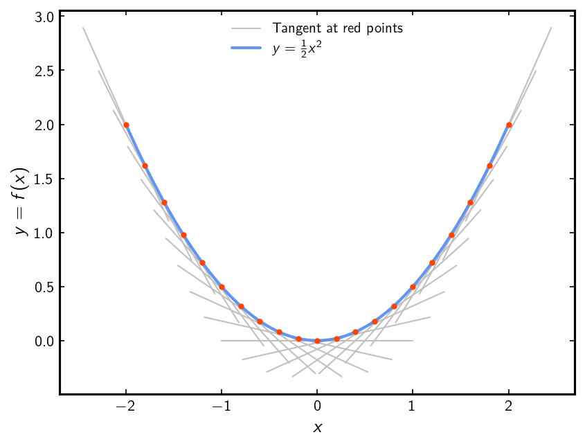

# Linear Regression

Our first task, a warm-up if you will, is to build a linear regression model. 
This is an example of a ==supervised learning== task where we have a set inputs (features) and a corresponding set of outputs (targets).
To achieve this, we need the three ingredients discussed in the Background section, namely:

1. a model,
2. a cost (a.k.a. loss) function,
3. a recipe to optimize the model, i.e., to update its free parameters.


### The model

For now, let's restrict to linear functions of one variable. 
By which we mean a polynomial whose variable, let's call it $x$, does not appear with with powers larger than 1 (so the polynomial does not contain terms with $x^2$, $x^3$ etc.). The most general linear function of one variable is thus,
$$
y = f(x) = w\,x + b\,.
$$
This model has 2 ==parameters==, the slope $w$ and the offset $b$. Our task is to ==learn== these parameters in order to best describe a dataset.

!!! example "Implement the model"
	
	```python
	import numpy as np
	
	def fx(x: np.ndarray, w: float, b: float) -> np.ndarray:
	
	    y = ...

	    return y	
	```
??? info "Math comment: Definition Polynomials"
    For us, a polynomial in a single variable is a function $f$ that takes a real number as argument and returns a real number (in short $f:\mathbb{R}\rightarrow\mathbb{R}$) of the from 
	$$ f(x) = a_0+a_1 x+a_2 x^2 + \ldots + a_n x^n = \sum_{i=0}^n a_i x^i $$ 
	with $n\in\mathbb{N}$ and $a_i \in \mathbb{R}$ (the symbol "$\in$" means "is element of").
	
??? info "Math comment: Different notions of linearity"
    The definition of a *linear function* as given above describes arbitrary straight lines and is usually formulated in the subfield of [analysis](https://en.wikipedia.org/wiki/Mathematical_analysis). In [linear algebra](https://en.wikipedia.org/wiki/Linear_algebra) and the general field of [algebra](https://en.wikipedia.org/wiki/Algebra) a different notion of linarity is used. Here a function $f:\mathbb{R}\rightarrow \mathbb{R}$ is called linear if and only if	
	$$ f(\alpha x) = \alpha f(x) \quad \text{and} \quad  f(x+y) = f(x) + f(y) \quad \forall \alpha,x,y\in\mathbb{R}\,, $$
	were " $ \forall $ " is the math symbol of "for all".  
	According to this definition our line from above ($f(x) = wx+b$) is not linear, can you see why?
	In algebra one would call such a map *affine linear* or simply *affine* but this notion goes beyond our little introduction.
	
	
??? question "Math side quest (optional!)"
	Proof the following statement:  
	Any algebraically linear function in one variable (see above definition) has the form 
	$$ f(x)=ax \quad \text{for a unique } a\in\mathbb{R} $$ 
	Hints:
	
	1. You have to use the properties of the difinition of linear functions. 
	2. You need to show both existance and uniqueness of such an $a$.
	3. Uniqunes proofs usually go as follows:
		- Assume ther exists another $a'$ that satisfies the above (i.e. f(x) = x a')
		- show that then $a'=a$ and therfore $a$ must be unique.
	4. If you have found a correct proof you can write either "q.e.d." (short for the latin "*quod erat demonstrandum*" that means "Which was to be proved/Was zu zeigen war") or the more modern " $ \square $ " at the bottom right corner to signal that the proof is finished.
### Loss function

The purpose of the loss function is to tell us "how well" we are able model the data for particular values of the parameters. The better the model describes the data, the smaller the loss ought to be.

A common loss function in regression is the Mean-Squared Error (MSE) which is given by
$$
\mathcal{L} = \frac{1}{N}\sum_{i=1}^N \left(y_i - t_i\right)^2 = \frac{1}{N}\sum_{i=1}^N \left(f(x_i) - t_i\right)^2\,,
$$
where $N$ is the number of $(x,t)$, i.e. (feature, target), pairs in the dataset and $y$ is the output of the model. (Technically, this is a measure for the expected value of the loss, $\mathbb{E}\left[\mathcal{L}\right]$.)
This loss function arises naturally if the underlying variation in the data is Gaussian which in many cases is a good assumption. However, one drawback of MSE loss is that it is sensitive to "outliers" in the data. We will examine this in more detail later and discuss possible mitigation strategies.

!!! example "Implement the loss function"

	```python
	def loss(x: np.ndarray, t: np.ndarray, w: float, b: float) -> float:
	    """Compute the MSE loss and return it
	    """

	    mse_loss = ...

	    return mse_loss
	```
??? info "Math comment: Expected values, sample mean & probability density"
	The notion of expected value belongs to the field of [probability theory](https://en.wikipedia.org/wiki/Probability_theory).  
	Suppose you conduct an experiment whose outcome is described by a vairable $X$ which can only be in one of two states, say $x_1$ or $x_2$ and let $p_1$, $p_2$ be the probabilities with which $X$ attains these values (e.g. think of a fair coin toss where we set $X=0$ for "tails", $X=1$ for "heads" and $p_1=p_2=\frac{1}{2}$), then the *expected value* $\mathbb{E}(X)$ of $X$ is given by
	$$ \mathbb{E}(X) = x_1 p_1 + x_2 p_2 $$
	
	In such a setting $X$ is called a *random variable*.  
	By repeatedly measuring outcomes of this experiment we can estimate the true expectation value using the *sample mean*.
	Assume we conducted $N$ experiments whose outcomes are given by $X_1,\ldots,X_N$ the *sample mean* is then defined by
	$$ \frac{1}{N}\sum_1^N X_i \approx \mathbb{E}(X)$$ 
	If you look back at the definition of the loss function from above you can see that it has the form of a sample mean and therfore is a measure for the expected value of the squared difference between the model value at the given features $f(x_i)$ and the targests $t_i$.  
	
	The definition of the *expectated value* given above can be directly generalized to the case where $X$ can be in finitely many different states.  
	Trick question, in how many possible states can our loss function be ? (maybe pause a bit and think about it.)  
	We are cutting corners here a bit, in order to properly introuce *expected values* for our case we would need [measures](https://en.wikipedia.org/wiki/Measure_(mathematics))/[integrals](https://en.wikipedia.org/wiki/Integral). These would allow us to assing probabilities to arbitrary collections of loss function values. One way of doing this goes via a *probability density functions* an example of which can be seen below:
	<figure markdown="span">
	{ width="600" }
	<figcaption></figcaption>
	</figure>
	 On the x-axis are all possible values for the random variable $X$, i.e. all real numbers. The probability with which $X$ takes a value in the interval $[a,b]$ (i.e. the probability for $a\leq X \leq b$) is given by the area that lies under the curve of the *probability density* in the same interval. In the above example X takes values in [0,1] with a probability of $34.1$%.
	
??? info "Math comment: Gaussians"
	A Gaussian is a specific *probability distribution*, tn fact, the probability density shown in the example above is a Gaussian probability distribution. Gaussian probability distributions are extreamly common in nature and everywhere around you, this is because of the [law of large numbers](https://en.wikipedia.org/wiki/Law_of_large_numbers).  
	It states that whenever you have many intependent random variables, say $X_1, \ldots X_n$, then the probability distribution 
	of their sample mean $\frac{1}{n}(X_1 + \ldots + X_n)$ becomes arbitrary close to a Gaussian for increasing $n$.
	
	One consequence of this is that whenever you perform repeated random experiments the sample mean of $n$ such experiments, thought of as a random variable itself, can be better and better approximated by a Gaussian probbility distribution the higher $n$ becomes. 
	
	Example insuracnes:
	The more people buy a particular insurance the better the average number of insurance cases per year can be described by a Gaussian probability distribution.

	
	

	
	

### Optimization

Now that we have a model and loss function, we need the third ingredient: a recipe to update the model parameters in order to minimize the loss. Well, the loss function we chose, MSE, is "differentiable" and a method for optimizing differentiable functions has been around since the mid 19th century. This method is known as _gradient descent_ optimization.

Things are getting a bit technical here and there is lot to unpack so let's look at it bit by bit:

<div class="annotate" markdown>
1. The ==gradient== of a function of more than one variable is a "vector" (better yet, it _transforms_ as a vector) whose components are the partial derivatives of the function with respect to those variables (1). The derivative of a function at a point is the slope of the tangent to that curve; in the figure just below, you can see a blue curve with red dots, the gray lines are the tangents to the curve at those dots.

2. Now the second part: ==descent==. So the derivative tells us the how steep or not the curve is at a point. Well, calculus tells us that the function has an _extremum_, i.e. a maximum or a minimum, where its (first) derivative is zero! That is, when the tangent curve is flat. ==We want to find the minimum because that is where the loss function is smallest==.

3. So the gradient tells us if the function is steep or flat. If it's steep, we want to **descend** down to where it's less steep until we get to the (or _a_) minimum where it's flat -- that's gradient descent!
</div>

1.  Okay, so where did the "more-than-one-variable" thing happen here? Recall that we want to optimize the loss function with respect to the parameters and our model has two of those!

<figure markdown="span">
  { width="600" }
  <figcaption>The gray segments are the tangents to the blue curve at each red point. The slope of the tangent lines are the values of the first derivative of the curve at each point.</figcaption>
</figure>

Back to our loss function and its gradient. The `loss_gradient` function will have to return two values not just one; i.e., the derivatives with respect to the slope, $w$, and the offset, $b$. Those are given by 

\begin{equation*}
\begin{split}
\frac{\partial\mathcal{L}}{\partial w} &= \frac{2}{N}\sum_{i=1}^N\left(w\,x_i^2 + b\,x_i - t_i\,x_i\right)\,,\\
\frac{\partial\mathcal{L}}{\partial b} &= \frac{2}{N}\sum_{i=1}^N\left(w\,x_i + b - t_i\right)\,.
\end{split}
\end{equation*}

!!! example "Implement the gradient of the loss function"

	```python
	def loss_gradient(x: np.ndarray, t: np.ndarray, w: float, b: float) -> tuple[float, float]:
	    """Compute the gradien of the loss function
	    """

	    dloss_dw = ...
	    dloss_db = ...

	    return (dloss_dw, dloss_db)
	```

#### The gradient descent algorithm

Now that we have the `loss_gradient` functions implemented, it's time to put it to use as follows:

<div class="annotate" markdown>
1. Start with _guesses_ for $w$ and $b$
2. Compute the gradient using those values
3. Update them to the new value $w'$ and $b'$ as:
    - $w' = w - \eta\,\frac{\partial\mathcal{L}}{\partial w}$
    - $b' = b - \eta\,\frac{\partial\mathcal{L}}{\partial b}$
4. Repeat this procedure until the loss ceases to get smaller (1).

The parameter $\eta$ should be small (i.e., $\eta <1$) and is called the ==learning rate==. Choosing the learning rate is one the most important (and tricky) ==hyperparameters== of the model to set.
</div>
1. When and how exactly to stop this procedure is quite a deep topic by itself.

!!! info "Stochastic gradient descent"

	Techinically, computing the gradient as described above means computing the gradient over the entire dataset. This, however, is slow and inefficient. A very convenient way to circumvent these problems is to compute the gradient on a subset of the data (a.k.a. a **batch**). These batches should be chosen randomly and should be anywhere from $\sim 32$ points to something larger :smile: depending on the size of the dataset for example.


!!! example "Implement stochastic gradient descent"

	The following pseudocode is adapted from the SGD algorithm (8.1) from the [Deep Learning](https://www.deeplearningbook.org/) book by Goodfellow, Bengio, and Courville [see chapter 8, page 291]
	```pseudocode
	\begin{algorithm}
	\begin{algorithmic}
	\STATE $\text{\textbf{input :}}$ $\text{learning rate}$, $\eta$
	\STATE $\text{\textbf{input :}}$ $\text{initial parameters}$, $w \text{ and } b$ 
	\PROCEDURE{Stochastic gradient descent}{$\eta, w, b$}
		\STATE $k = 1$
		\WHILE{do_another_epoch == True}
			\FOR{batch in minibatches}
				\STATE compute loss function
				\STATE compute gradient of loss function: $\frac{\partial\mathcal{L}}{\partial w},\frac{\partial\mathcal{L}}{\partial b}$
				\STATE update parameters: $w = w - \eta\, \frac{\partial\mathcal{L}}{\partial w}$
				\STATE $\quad\quad\quad\quad\quad\quad\quad\quad b \,= b - \eta\, \frac{\partial\mathcal{L}}{\partial b}$				
			\ENDFOR
			\STATE update $\mathrm{do\_another\_epoch}$
			\STATE $k = k+1$
		\ENDWHILE
	\end{algorithmic}
	\end{algorithm}
	```


## Putting it all together

Okay so now we have the different pieces that we need to actually _do_ the regression. But first, we need some data. To have full control of the features (i.e., the _true_ underlying model) of this dataset, let's create some synthetic (artificial) data with `scikit-learn`.


### Making a synthetic dataset

```python
from sklearn.datasets import make_regression
seed = 73022375
n_samples = 10000
np.random.seed(seed)
b_true = (np.random.rand()-0.5)*2
features, targets, w_true = make_regression(
    random_state=seed,
    n_samples=n_samples,
    n_features=1,
    n_targets=1,
    bias=b_true,
    noise=20,
    coef=True
)
# NOTE: the X array returned by scipy.datasets.make_regression is not a 1d array  even if n_features=1
features = np.squeeze(features)
#Note: By default w_true is sampled in the range (0,100) lets rescale that to the range (0,1)
targets = (targets-b_true)/100+b_true
w_true/=100
```
You can plot the resulting dataset via
```python
from matplotlib import pyplot as plt
#Load a colormap
cmap = plt.get_cmap('viridis')
cmap.set_under('white')

#Plot data histogram
fig,ax = plt.subplots()
hist = ax.hist2d(features,targets,bins=int(np.sqrt(n_samples)),cmap=cmap,vmin=1)
cbar = fig.colorbar(hist[-1])
cbar.set_label('counts')

#Plot true linear model
xs = np.linspace(features.min()*1.2,features.max()*1.2)
ax.plot(xs,fx(xs,w_true,b_true),color = 'red')

#Set aspect ration and axis limits and labels
ax.set_aspect('equal')
ax.set_xlabel('feature value')
ax.set_ylabel('target value')
ax.set_xlim((-4,4))
ax.set_ylim((-4,4))
```
<figure markdown="span">
  { width="600" }
  <figcaption>Take a moment and check if you understand what is illustrated here.</figcaption>
</figure>


## Fit the parameters of the model and investigate your results

Using SGD as described [above](#the-gradient-descent-algorithm), fit the parameters of the model and compare them with the parameters used to generate the dataset. 

Here are a few things you should carefully consider (and **experiment** with!):

<div class="annotate" markdown>
 - The initial guesses for $w$ and $b$.
 - The learning rate: a good starting value is something like 0.01 or 0.001 but play around and see what different values do.
 - The number of training epochs. (1) Did you ask for too many or too few? How can you tell (see list below for hints).
</div>
1.  Epochs count how many times you use the entire dataset during training, i.e., how many times the outer loop of the SGD algorithm described above is executed.


And here are a few things you should _definitely_ do:

 - Plot the loss (at least `#!matplotlib plt.semilogy` or `#!matplotlib plt.loglog`) as a function of training steps (batches).
    * Is it smooth or does have a lot of noise?
    * Are there features like a "knee" where the behavior qualitatively changes?
    * Did the loss reach an asymptotic value? If so, did the training continue for long after that?
 - Plot the model parameters as function of training steps
 - Plot the data (`#!python plt.scatter`) and the fitted model

