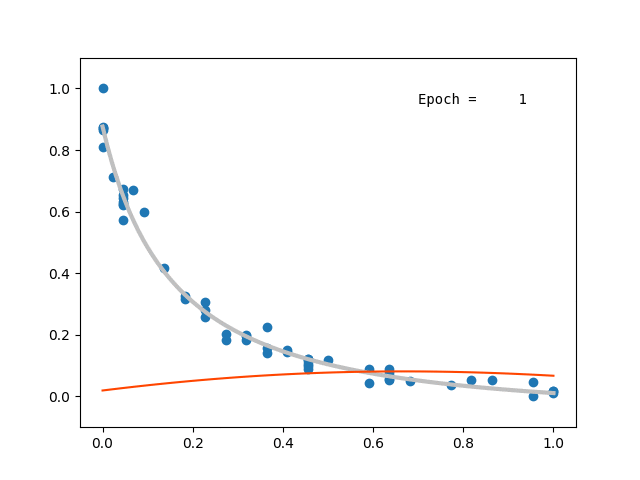

# A simple dataset for testing

The (U.S.) National Institute of Standards and Technology (NIST) has a nice collection of datasets for non-linear regression along with 'certified' fit parameters.

The page that lists these datasets is [itl.nist.gov/div898/strd/nls/nls_main.shtml](https://www.itl.nist.gov/div898/strd/nls/nls_main.shtml).
You can choose whichever model you like. But to be concrete here, I will take the `Chwirut2` [dataset](https://www.itl.nist.gov/div898/strd/nls/data/chwirut2.shtml) which is exponential-distributed and described by a 3-parameter model.

Let's also implement the model using the [NIST certified parameters](https://www.itl.nist.gov/div898/strd/nls/data/LINKS/v-chwirut2.shtml). The model is
$$
f(x; \beta) + \epsilon = \frac{\exp(-\beta_1 x)}{\beta_2 + \beta_3 x} + \epsilon\,,
$$
with $\beta_1$, $\beta_2$, and $\beta_3$ given by
```
               Certified              Certified
Parameter      Estimate               Std. Dev. of Est.
  beta(1)      1.6657666537E-01       3.8303286810E-02
  beta(2)      5.1653291286E-03       6.6621605126E-04
  beta(3)      1.2150007096E-02       1.5304234767E-03
```

Here is the Python implementation of this model with the best-fit parameters.
```py
def fcert(x: np.ndarray) -> np.ndarray:
    
    beta1 = 1.6657666537E-01
    beta2 = 5.1653291286E-03
    beta3 = 1.2150007096E-02

    return np.exp(-beta1*x) / (beta2 + beta3*x)
```

!!! danger "Normalizing the dataset"

    For many reasons, neural networks **do** care about the normalization of the data. In particular, when using the `sigmoid` activation function wich has a range $\in [0,1]$, this would save a lot of unecessary frustration.

<figure markdown="span">
  { width="600" }
  <figcaption>Network prediction during training.</figcaption>
</figure>

